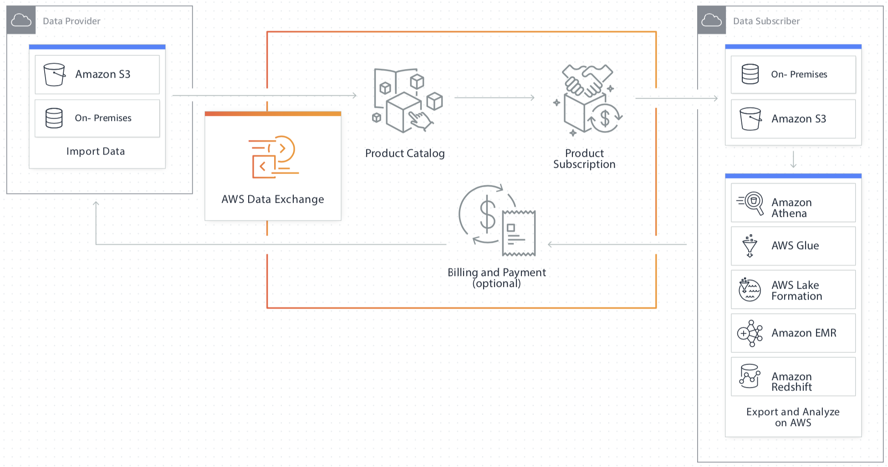

# AWS Data Exchange Samples

[AWS Data Exchange](https://console.aws.amazon.com/dataexchange/) is a service that makes it easy for millions of AWS customers to securely find, subscribe to, and use third-party data in the cloud. This repository contains a collection of samples that interact with the AWS Data Exchange API.

## Subscriber Samples

Examples of interacting with the AWS Data Exchange API from the data subscriber side can be found in [/subscribers](subscribers).

### Ruby

* [all-entitled-datasets](subscribers/ruby/all-entitled-datasets): Lists all data sets one is subscribed to.
* [most-expensive-neighborhoods-in-nyc](subscribers/ruby/most-expensive-neighborhoods-in-nyc): Most expensive neighborhoods in NYC by median price.

### JavaScript

* [all-entitled-datasets](subscribers/javascript/all-entitled-datasets): Lists all data sets one is subscribed to.

### Go

* [all-entitled-datasets](subscribers/go/all-entitled-datasets): Lists all data sets one is subscribed to.

## Provider Samples

Examples of interacting with the AWS Data Exchange API from the data provider side can be found in [/providers](providers).

### Ruby

* [create-data-set-with-finalized-revision](providers/ruby/create-data-set-with-finalized-revision): Create a data set with a finalized revision.

### Python

* [download-entitled-assets](subscribers/python/download-entitled-assets/download-entitled-assets.py): Download all assets to which you've subscribed.
* [pandas-describe-csv](subscribers/python/pandas-describe-csv/pandas-describe-csv.py): Download a CSV asset by arn, import it into a pandas Data Frame, and describe() the result.

## License

This library is licensed under the MIT-0 License. See the [LICENSE](LICENSE) file.
