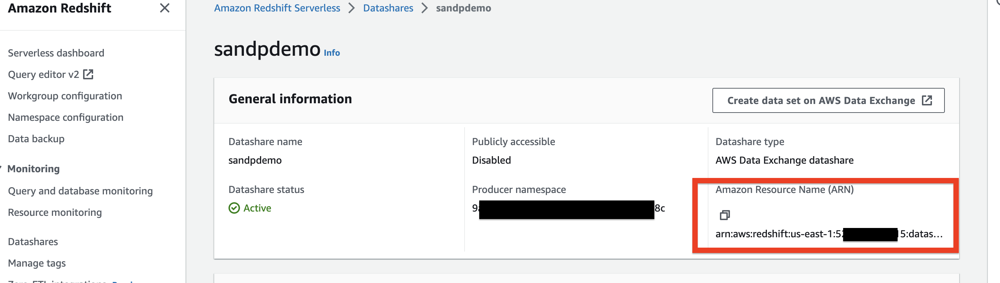

# Add Amazon Redshift Datashare Dataset (Python)

This example will create a data set for Amazon Redshift Datashare. The data set will contain an
Amazon Redshift Datashare, which enables subscribers to have read-only access to shared tables and views added to the Datashare.

### Setup

Install the requirements:

```bash
$ pip3 install -r requirements.txt
```

Set the AWS access key and secret environment variables:

```
$ export AWS_ACCESS_KEY_ID=<your-access-key-id>
$ export AWS_ACCESS_KEY_ID=<your-access-key-id>
$ export AWS_SECRET_ACCESS_KEY=<your-secret-access-key>
$ export AWS_SESSION_TOKEN=<your-session-token>
```

The user needs the **AWSDataExchangeProviderFullAccess** IAM policy associated with your role/account. Find out more
about IAM policies on AWS Data Exchange [here](https://docs.aws.amazon.com/data-exchange/latest/userguide/auth-access.html).

The user should create an Amazon Redshift Datashare managed by ADX using Amazon Redshift serverless or RA3 provisioned clusters.  
```
CREATE DATASHARE [datashare_name] SET PUBLICACCESSIBLE TRUE, MANAGEDBY ADX;
ALTER DATASHARE [datashare_name] ADD SCHEMA [schema]
ALTER DATASHARE [datashare_name] ADD TABLE [table_name]
ALTER DATASHARE [datashare_name] ADD FUNCTION [function_name]
```

You can then note down the Datashare ARN from the console by choosing the Datashare created.



### Example Usage

Get usage help: `python3 add-amazon-redshift-dataset.py --help`

Share an Amazon Redshift Datashare: `python3 add-amazon-redshift-dataset.py --data-set-name 'programmatic-redshift-example' --datashare-arn 'arn:aws:redshift:us-east-1:123456789012:datashare:9aa6adfe-0q13-1234-a2cd-ef1234dd908c/demo' --region us-east-1`

**Note**: You may specify a `data-set-id` parameter to add an Amazon Redshift Datashareto an existing data set. Any existing
datashares will be replaced.
