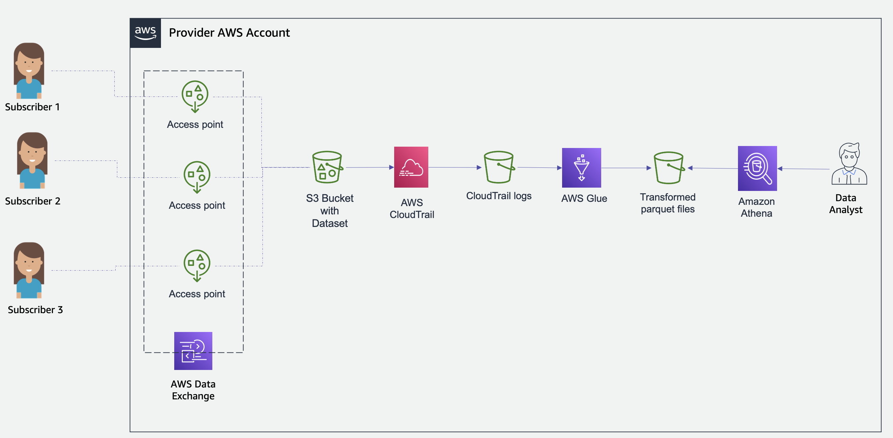

AWS Data Exchange for Amazon S3 unlocks new use cases for providers to offer data files via AWS Data Exchange. Providers can 
easily set up AWS Data Exchange for Amazon S3 on top of their existing S3 buckets to share direct access to an entire S3 bucket or specific prefixes and S3 objects. 
AWS Data Exchange automatically manages subscriptions, entitlements, billing, and payment. 

This package sets up the infrastructure via CloudFormation in a Data Providers' own AWS Account
to report and visualize subscriber usage on AWS Data Exchange for Amazon S3 data sets. 

### Architecture

This package creates the following infrastructure via CloudFormation

1. CloudTrail to log all readonly events on S3 Access points across all regions
2. S3 Bucket to store the logs
3. Glue Job that runs daily to process the json logs to parquet files
4. Glue Database and table to query the data and derive insights



### Setup

#### Prerequisites
You should have
* An AWS Data Exchange for Amazon S3 product and data set published.
* Permissions to upload file to an existing S3 bucket and deploy a cloudformation template

#### Deployment

1. Clone the repository to your local system.
2. Upload the [python script](./source/adx_metrics_processing.py) to an existing S3 bucket in your AWS Account. You can refer [aws docs on how to upload files](https://docs.aws.amazon.com/AmazonS3/latest/userguide/upload-objects.html).
3. Copy the s3 URI of the python script.
4. Create a CloudFormation Stack by uploading the [CloudFormation Template](./source/adx_metrics_infrastructure.yaml) through the Cloudformation console. The stack requires 4 parameters:
```
CloudTrailName : Name of the multiregion CloudTrial
GlueDatabaseName : Name of the Glue Database
GlueScriptLocation : S3 path of the Glue script that you copied in Step 3.
GlueJobScheduledHour : Scheduled hour to run the glue job daily
```
The default values are provided for your convenience. The stack takes about 2-4 minutes to be created.

The stack creates a  Glue job runs only once a day. You will be able to see the
table with usage data once Glue job has been successful.

Note: If your AWS Glue resources are managed by AWS Lake Formation, it's crucial to grant the required data lake permissions for these resources. 
Failure to do so may result in Glue jobs encountering "Insufficient Lake Formation permissions," or “Unable to verify existence of default database” leading to job failures. Please review below -
* The glue job execution role needs to have Super permissions on the glue database ‘adx_metrics_curated’ and ‘All tables’ in the ‘adx_metrics_curated’ database.
* Grant DESCRIBE Lake Formation permission to Default glue database to be able to verify the existence of the default database.


### Example Queries
Once the table has been created and the Job has been successful, you can query the data
in [Amazon Athena](https://www.amazonaws.cn/en/athena/). Here are a few Sample Queries:

* Query to see unique subscriber AWS account IDs that have accessed the AWS Data Exchange for S3 datasets in a given year and month
```
SELECT distinct subscriber_account_id FROM "adx_metrics_curated"."adx_for_s3_metrics"
where year='2023'and month ='05' and subscriber_account_id != 'anonymous'
```

* Type and number of events(get, list, head) of each type in a given month and year.
```
SELECT eventName, count(1) as eventCount FROM "adx_metrics_curated"."adx_for_s3_metrics"
where year='2023'and month ='05' and subscriber_account_id != 'anonymous' group by eventName order by eventCount desc
```